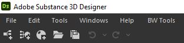
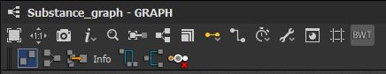

Notable Changes From BWTools 1.x
================================
* Replaced the top toolbar icon with a menu bar to access the tools. This now lives next to the Help menu.

* Moved all graph related tools to the graph view toolbar. It can be toggled on and off by the BWT icon.

* Added a new module called :ref:`BW Framer`, which lets you reframe a selection quickly and provide default settings for the frame. No more manually adjusting frames.
* You can no longer run the tools on graphs types currently unsupported by the Designer API, which caused a crash. See :ref:`Unsupported Graph Types` for more info.
* Added more detailed tooltips.
* New documentation! You are reading it now.
* Code cleanup so it is a little more readable for this release.

BW Layout Tools Changes
^^^^^^^^^^^^^^^^^^^^^^^
* Considerable speed increase when running the layout tool.
* The mainline feature (which pushed nodes back) is now toggleable.
* Added multiple layout styles.
* Added a snap to grid option.
* Added option to run :ref:`BW Straighten Connection` after running layout.
* Several bug fixes in layout behavior. The default behavior may be slightly different in this release.
* See :ref:`BW Layout Graph` for full documentation.

BW Optimize Changes
^^^^^^^^^^^^^^^^^^^
* Removed features which are now handled natively by Designer.
* Fixed a bug which would incorrectly identify some nodes as duplicates.

BW PBR Reference Changes
^^^^^^^^^^^^^^^^^^^^^^^^^
* Can now be opened from the new menu bar.
* Removed custom color support in order to simplify the code for public release.

BW Straighten Connection Changes
^^^^^^^^^^^^^^^^^^^^^^^^^^^^^^^^
* Now supports two different layout styles, see :ref:`BW Straighten Connection`.