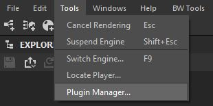
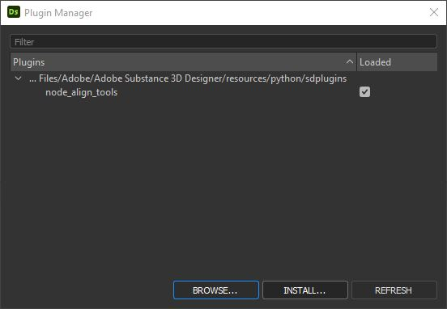

How To Install
==============

.. admonition:: Have A Previous Installed?
   :class: important

    You must first manually delete the previous version of bw_tools from your plugins folders.

    This is your documents folder by default
    C:/Users/UserName/Documents/Adobe/Adobe Substance 3D Designer/python/sduserplugins

    If unsure, you can quickly get to the appropaite folder by right clicking the plugin inside Tools > Plugin Manager... and selecting Show In File Browser...

    Delete the previous bw_tools folder

To install, launch Substance Designer and to go Tools > Plugin Manager...

Click Install...

Select the downloaded .sdplugin file

