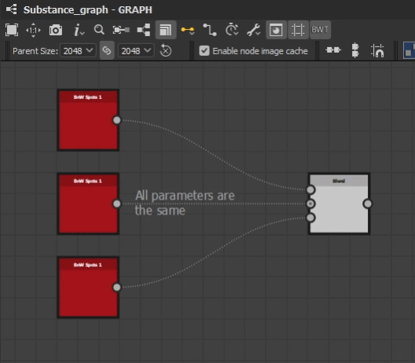
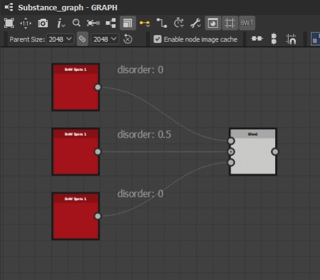
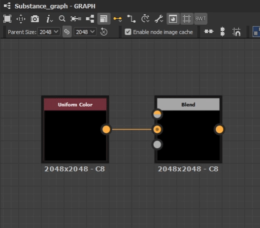
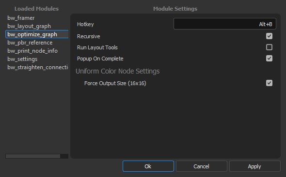

BW Optimize Graph
=================
Attempts to optimise your selection for graph performance by removing duplicate nodes and setting appropiate output sizes.

Removing Duplicate Nodes
------------------------
The tool analyzes each node in your selection to identify duplicates nodes.
A node is considered a duplicate if all parameter settings and inputs are the same.
If recursive is checked, will continue to run the tool on your selection, until no more duplicate nodes are found.
This is useful to find and remove duplicate chains of nodes.

If a property has a function graph connected, it will not be considered a duplicate, even if all other parameters are.

Uniform Color Nodes
-------------------
All uniform color nodes in your selection will have their output size forced to 16x16 (the optimal output size for Designer)
and the connected outputs set to relative to parent. If the uniform color node has a function graph applied to the output
size property, it will not be changed.

Optimize Settings
-----------------

Optimize Hotkey
^^^^^^^^^^^^^^^
The hotkey assigned to the run the tool, written as a string. Combine key combinations with "+". Requires a restart.

Recursive
^^^^^^^^^
When checked, will recursively run the tool until no more nodes have been optimized.

Run Layout Tools
^^^^^^^^^^^^^^^^
Whether or not to run the layout graph tools after running the optimizer. See :ref:`layout`.

Popup On Complete
^^^^^^^^^^^^^^^^^
When checked, a popup will prompt the user with information about what was done to the graph.
The same information is printed to the console regardless of this setting.

Uniform Color Node Settings
---------------------------

Force Output Size (16x16)
^^^^^^^^^^^^^^^^^^^^^^^^^
Whether or not to optimize uniform color nodes output size.
