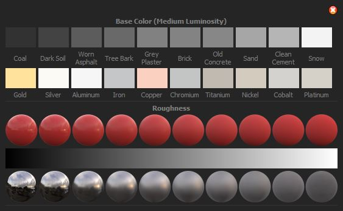
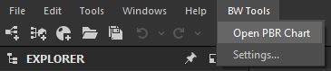
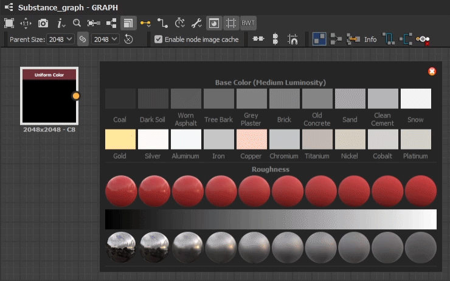
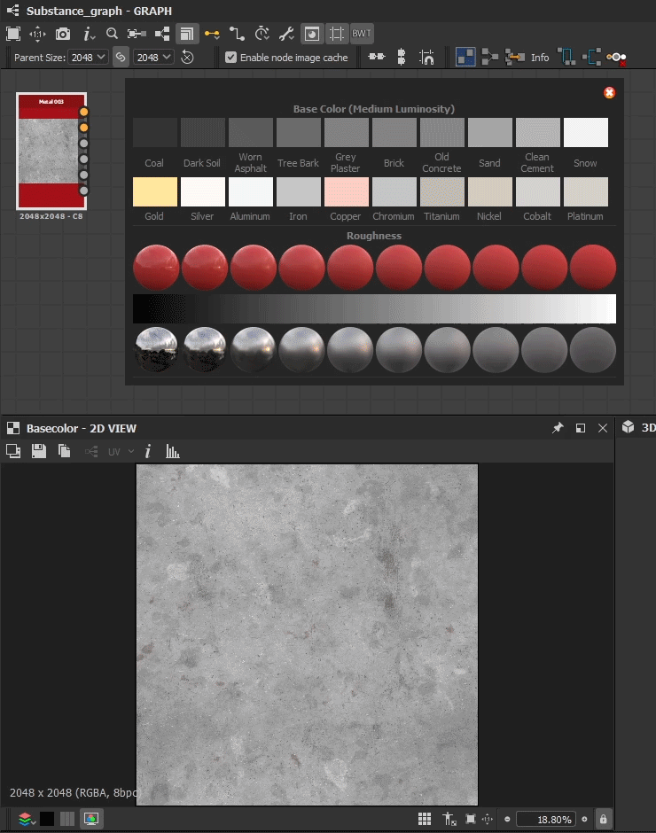

PBR Reference
=============
A convenient PBR color chart built directly into Designer.
It provides various pbr values, based on `DONTNOD 2014 pbr chart <https://seblagarde.wordpress.com/2014/04/14/dontnod-physically-based-rendering-chart-for-unreal-engine-4/>`_,
to quickly and easily reference without the need to having a downloaded color chart opened in windows.

PBR Reference Usage
-------------------
To open the pbr chart, navigate to BW Tools > Open PBR Chart

Color Picking
-------------
The window is always displayed ontop of the designer viewport, making it easy to color pick from

Dragable Swatches
-----------------
Swatches are select-able, drag-able and hide the UI to allow for easy comparison with your texture.
Useful to click and drag over the 2d view to visually compare values directly.

