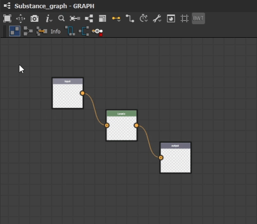
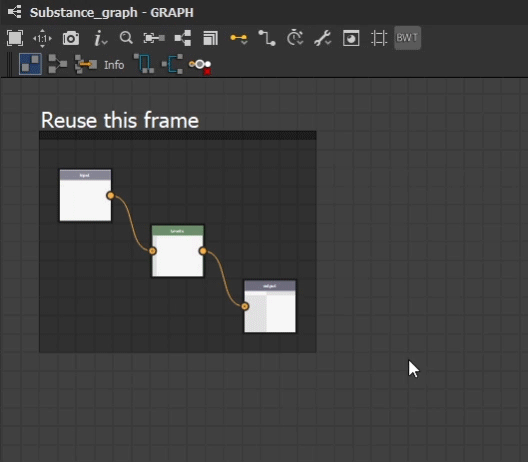
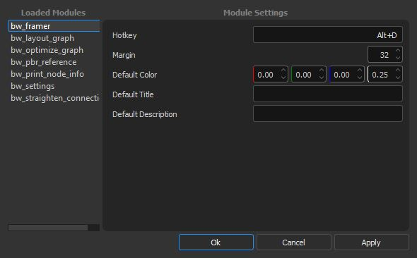
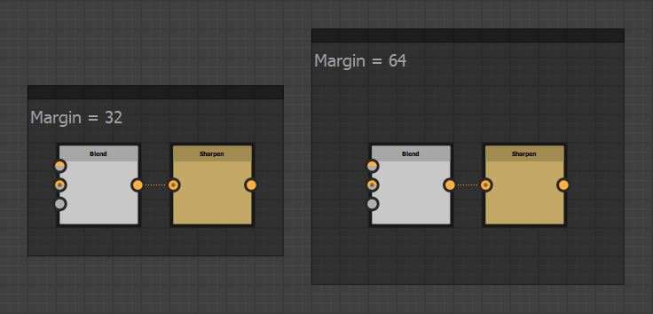
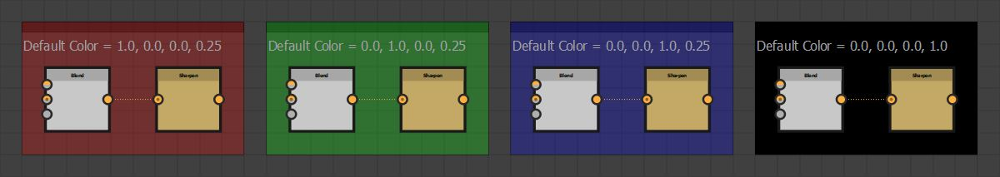
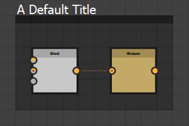
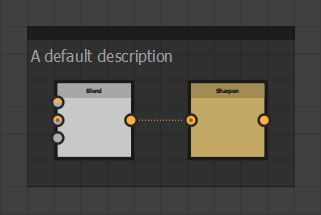

BW Framer
=========

BW Framer lets you frame your selection with a Hotkey and default settings. It can be thought of as an extension to the existing framing tools.
Unlike the existing tools however, BW Framer will recognise and update existing frames to your new selection, meaning you no longer need to make manual adjustments or delete them to refit the frame.

Drawing New Frames
------------------
You can draw a new frame by selecting your nodes and running the framer tool. Default hotkey Alt+D

Redrawing Existing Frames
-------------------------
If you have a frame already selected, it will reuse that frame and refit it to your selection

.. admonition:: Multiple Frame Selections
   :class: caution

    If you select multiple frames in your selection, the left most frame will be used and the others deleted

    .. image:: ../images/framer/frame_selected_multiple_frames.gif

Settings
--------

Hotkey
^^^^^^
The hotkey assigned to the run the tool, written as a string. Combine key combinations with "+"

Margin
^^^^^^
The spacing around the edges of the node

Default Color
^^^^^^^^^^^^^
The color of the frame in [RGBA]

Default Title
^^^^^^^^^^^^^
The default title. Leave empty to remove the title

Default Description
^^^^^^^^^^^^^^^^^^^
The default description. Leave empty to remove the description

