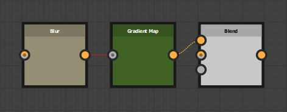
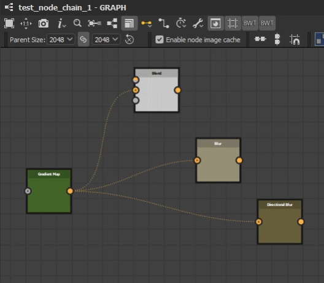
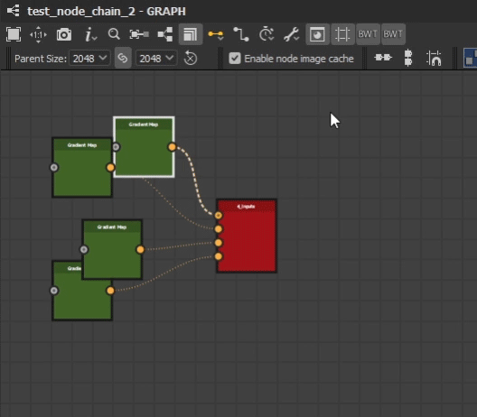
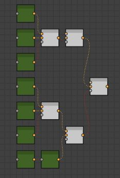

BW Layout Graph
===============
Automatically align selected nodes based on their hierarchy, arranged to minimise overlapping.
Align a given nodes inputs about their center point, stack them on top of each other or align them by their mainline. See Mainline.

Node Placement Behavior
-----------------------
Simple Chain
^^^^^^^^^^^^
Nodes are placed behind their output nodes.

When a node has multiple outputs, it will align to the right most output. Visually creating the longest straight line.

Simple Hierarchy
^^^^^^^^^^^^^^^^

When a node has branching outputs, all it's inputs are aligned relative to the current position. Input nodes are stacked based on the input order and the specific alignment is determined by its `Input Alignment Behavior`_.
A nodes height is taken into account when aligning sibling nodes in a chain.

Where the hierarchy extends deeper, nodes will move to avoid any overlap.

.. admonition:: Hidden Inputs/Outputs
   :class: important

    Some nodes have hidden inputs or outputs, defined by the visibleif condition. Currently there is no way to access this information with the Designer API and as such they will be included in the height calculation.
    This means these node will have a height value as if all inputs and outputs were visible.

    .. image:: ../images/layout/hidden_outputs.jpg

Input Alignment Behavior
^^^^^^^^^^^^^^^^^^^^^^^^
This property controls the alignment of input nodes relative to their output.

Mainline Input Alignment:
The mainline node will align to the center of the output and siblings will position above or below. See Mainline

Looping Networks
^^^^^^^^^^^^^^^^^^^^^^^
placing behind closest output
y align to farthest
test_chain_8 sibling above moved above branching output sibling to minimise connection crossing over
    ddoesnt do it when under mainline

Network Chain Behavior
----------------------

moved above / below sibling
without mainline / with mainline comparsion in x and y
if mainline then sibling is center

Root Nodes
^^^^^^^^^^
stay in place
is a top parent node
multiple output roots
roots considered serarate Chains
make room for expanding network

Mainline
--------
largest network, where branch is considered a new Chain
moved back behind

Settings
--------