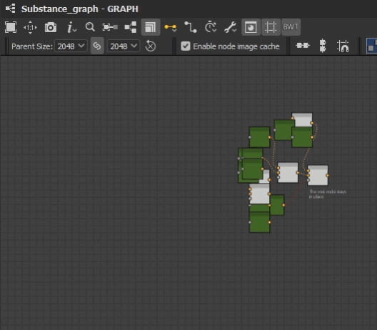

BW Layout Graph
===============
Automatically align selected nodes based on their hierarchy, arranged to minimise overlapping.
Align a given nodes inputs about their center point, stack them on top of each other or align them by their mainline. See Mainline.

Node Placement Behavior
-----------------------
Simple Chain
^^^^^^^^^^^^
Nodes are placed behind their output nodes.

.. image:: ../images/layout/inline.jpg

When a node has multiple outputs, it will align to the right most output. Visually creating the longest straight line.

.. image:: ../images/layout/farthest_output.gif

Simple Hierarchy
^^^^^^^^^^^^^^^^
When a node has multiple inputs, they are aligned relative to the current position.
Input nodes are stacked based on the input order and the specific alignment setting. See `Vertical Alignment Behavior`_.
Node heights are taken into account when aligning input nodes in a chain.

.. image:: ../images/layout/stacking_nodes.gif

Where the hierarchy extends deeper, nodes will move to avoid any overlap.

.. image:: ../images/layout/hierarchy_1.jpg

.. admonition:: Hidden Inputs/Outputs
   :class: important

    Some nodes have hidden inputs or outputs, defined by the visibleif condition.
    Currently there is no way to access this information with the Designer API and as such they will be included in the height calculation.
    This means these node will have a height value as if all inputs and outputs were visible.

    .. image:: ../images/layout/hidden_outputs.jpg

Root Nodes
^^^^^^^^^^
Where nodes have no connected outputs, they are considered Root Nodes. 
When running the tool, these nodes will stay in place and all inputs will align to it

.. admonition:: Root Node Behavior
   :class: important

   That is, no connected outputs in your active selection.
   A Node may have connected outputs in your graph, but at the head of your selection, making it a root node.

   .. image:: ../images/layout/root_node_in_sel.gif

If your selection contains multiple root nodes, they are considered as separate chains.
Therefore, is important to provide enough spacing for the network to fully expand.

Vertical Alignment Behavior
^^^^^^^^^^^^^^^^^^^^^^^^^^^
Input nodes will align relative to their output. if a node has multiple outputs, it will align to the farthest output. See `Multiple Output Nodes`_.

Mainline Input Alignment:

The mainline node will align to the center of the output and siblings will position above or below. See Mainline Settings for information about what a mainline is

.. image:: ../images/layout/vertical_align_mainline.jpg

Multiple Output Nodes
^^^^^^^^^^^^^^^^^^^^^
Some nodes have multiple outputs and may connect to various points in the network.
In these cases, the node will always be positioned behind the closest output and aligned with the farthest output.

Mainline
--------
largest network, where branch is considered a new Chain
moved back behind

Settings
--------

