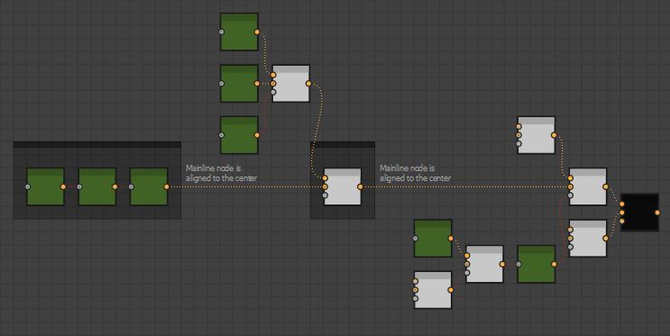

BW Layout Graph
===============
Automatically align selected nodes based on their hierarchy, arranged to minimise overlapping.
Align a given nodes inputs about their center point, stack them on top of each other or align them by their mainline. See `Mainline Concept`_.

Node Placement Behavior
=======================
Simple Chain
------------
Nodes are placed behind their output nodes.

.. image:: ../images/layout/inline.jpg

When a node has multiple outputs, it will align to the right most output. Visually creating the longest straight line.

Simple Hierarchy
----------------
When a node has multiple inputs, they are aligned relative to the current position.
Input nodes are stacked based on the input order and the specific alignment setting. See `Vertical Alignment Behavior`_.
Node heights are taken into account when aligning input nodes in a chain.

Where the hierarchy extends deeper, nodes will move to avoid any overlap.

.. image:: ../images/layout/hierarchy_1.jpg

.. admonition:: Hidden Inputs/Outputs
   :class: important

    Some nodes have hidden inputs or outputs, defined by the visibleif condition.
    Currently there is no way to access this information with the Designer API and as such they will be included in the height calculation.
    This means these node will have a height value as if all inputs and outputs were visible.

    .. image:: ../images/layout/hidden_outputs.jpg

Root Nodes
----------
Where nodes have no connected outputs, they are considered Root Nodes. 
When running the tool, these nodes will stay in place and all inputs will align to it

.. image:: ../images/layout/root_nodes.gif

.. admonition:: Root Node Behavior
   :class: important

   That is, no connected outputs in your active selection.
   A Node may have connected outputs in your graph, but at the head of your selection, making it a root node.

   .. image:: ../images/layout/root_node_in_sel.gif

If your selection contains multiple root nodes, they are considered as separate chains.
Therefore, is important to provide enough spacing for the network to fully expand.

.. image:: ../images/layout/root_node_space.gif

Vertical Alignment Behavior
---------------------------
Input nodes will align relative to their output. if a node has multiple outputs, it will align to the farthest output.
See `Multiple Output Nodes`_.
Otherwise, alignment will be defined by the one of the following behaviors below.

Mainline Alignment
^^^^^^^^^^^^^^^^^^
The mainline node will align to the center of the connected output node and siblings will position above or below accordingly.
See `Mainline Concept`_ for information about what a mainline is.

In the event that a mainline node is not successfully found, alignment will revert to `Center Alignment`_

Center Alignment
^^^^^^^^^^^^^^^^
The center point of all the inputs will align to the connected output node.

Top Alignment
^^^^^^^^^^^^^
Input nodes are stacked ontop of each other and the top node is aligned to the connected output.

Multiple Output Nodes
---------------------
Some nodes have multiple outputs and may connect to various points in the network.
In these cases, the node will always be positioned behind the closest output and aligned with the farthest output.

.. image:: ../images/layout/behind_closest_output.jpg

Mainline Concept
================
The tool will attempt to identify a mainline through the network. This is to mirror a common layout
strategy used by many artists to organise their graphs, where a horizontal structure is defined and
logical units connect into it.

When evaluating the alignment for a given nodes inputs, the tool will use the following criteria to
define which node is the part of the mainline.

1. From a given nodes inputs, the one deepest in the network will become the mainline.
   
   .. image:: ../images/layout/mainline_deepest_node.jpg

2. If all nodes are in line with each other, the input node with the deepest chain will become the mainline.

   .. image:: ../images/layout/mainline_deepest_chain.jpg

3. If all input node chains are of the same length, it will declare no mainline node could be found.

When a mainline node was successfully found, it will either be moved back, based on the `Mainline Settings`_ 
or not. If a mainline node is not found, no nodes will be moved back. In either case 
the `Vertical Alignment Behavior`_ will define how the input nodes align vertically.

Evaluation Order
================
The tool runs in several passes and is evaluated from left to right, top to bottom, meaning the deepest part of the
network is resolved first.

1. Sort nodes by their hierarchy.
2. Apply mainline offsets, if `Enable Offset Mainline`_ is on.
3. Align nodes vertically basee on their `Vertical Alignment Behavior`_.
4. Apply node snapping, if `Snap To Grid`_ is on.
5. Insert dot nodes, if `Straighten Connection Settings`_ is turned on.

Settings
========

Hotkey
------
The hotkey assigned to the run the tool, written as a string. Combine key combinations with "+".

Vertical Alignment
------------------
The vertical alignment behavior to use. See `Vertical Alignment Behavior`_ for more information.

Node Spacing
------------
The spacing between nodes, given in absolute units of the graph grid.

.. image:: ../images/layout/node_spacing.jpg

Node Count Warning
------------------
Whether or not to prompt the user if more node than the given threshold is selected when running the tool.
This is helpful to alert the user that the tool could potentially take some time to run.

Snap To Grid
------------
Whether or not to snap nodes to the grid after running the tool. This setting does not apply to any dot nodes
inserted by the tool.

.. note:: This setting uses Designer's native snap to grid script

Mainline Settings
-----------------

Enable Offset Mainline
^^^^^^^^^^^^^^^^^^^^^^
Whether or not to offset the mainline node. When set to true, the mainline node is only moved back if one is successfully
found in a nodes inputs. See `Mainline Concept`_

Offset Amount
^^^^^^^^^^^^^
The amount to offset the mainline node, given in absolute units of the graph grid.
.. note:: This is in addition to the node spacing value.

Adjacent Chain Threshold
^^^^^^^^^^^^^^^^^^^^^^^^
When a mainline node is found, this setting defines the threshold by which the sibling chains depth must be larger in order to
apply the offset. 

Straighten Connection Settings
------------------------------
Information about the Straighten Connection can be found here
:doc:`Straighten`
   
Enable
^^^^^^
Whether or not to run the straighten connection tool after running the layout tool.

Alignment
^^^^^^^^^
The algorithm to use when running straighten connection after running the layout tool. See