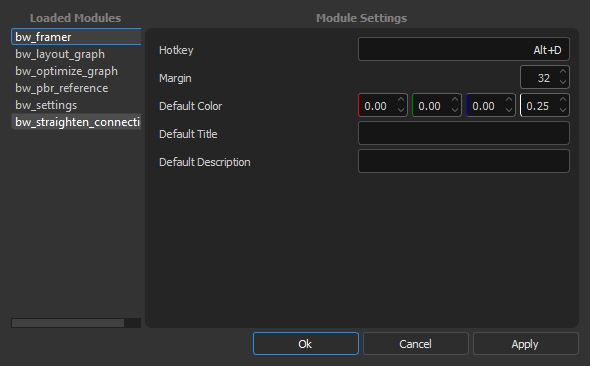
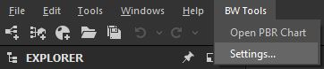

BW Settings
===========
Window displaying all settings for all loaded modules

Usage
-----
Nativate to BW Tools > Settings...

Changing Hotkey Settings
------------------------
Changing the hotkey for a setting requires a restart of Designer.

The string format for a hotkey is <Modifiers>+<Hotkey>, not including any quotation marks.

for example (exclduing the quotes)

``C``
``Alt+D``
``Ctrl+Shift+A``

Reverting To Default Settings
-----------------------------
If you want to revert your settings for a particular module or otherwise run into an problem,
you can delete the <module_name>_settings.json file directly and restart Designer.

The <module_name>_settings.json is located in the plugin <install directory>/bw_tools_2_0_0/bw_tools_2_0_0/bw_tools/modules/<module_name>
For example:
``C:\Users\User\Documents\Adobe\Adobe Substance 3D Designer\python\sduserplugins\bw_tools_2\bw_tools_2\bw_tools\modules\bw_framer\bw_framer_settings.json``

Upon restart, a fresh settings file will be created with default settings.

