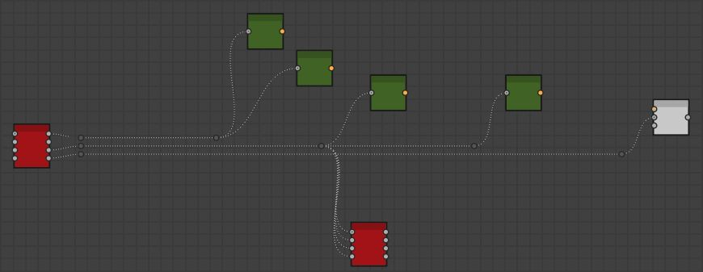
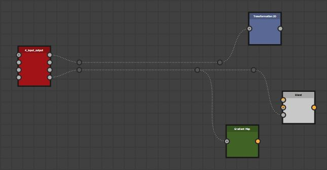
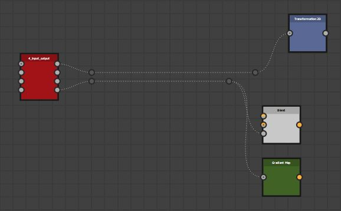
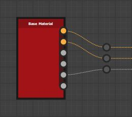
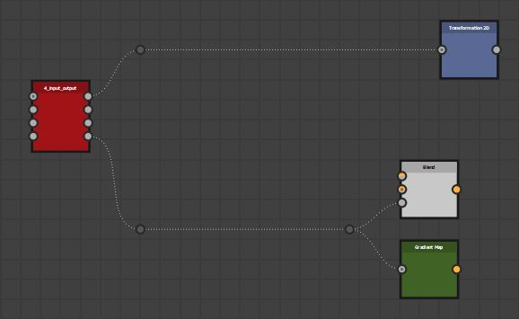
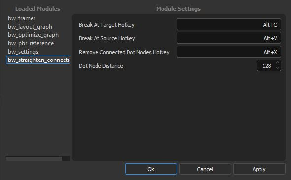

.. _straighten:

BW Straighten Connection
========================
Straightens connection from selected nodes to all outputs by inserting dot nodes into the connection.
There are two modes of operation which defines the visual behavior.
`Break At Target`_ and `Break At Source`_.

Break At Target
---------------
This mode will align dot nodes horizontally inline from the source node and break away when they reach the target.

If a given output has more than one connection, the dot nodes will chain together.

If two more more output nodes are close together, they will reuse an existing dot node.

Multiple Outputs
^^^^^^^^^^^^^^^^
Where nodes have multiple outputs, but fewer connections, dot nodes will align to the center of the source node.

Break At Source
---------------
This mode will break away at the source node and align horizontally with the target.

If a given output has more than one connection, the dot nodes will chain together.

If a given output has more than one connected node, the dot nodes will align to the mid point of those output nodes.

If two more more output nodes are close together, they will reuse an existing dot node.

Settings
--------

Break At Target Hotkey
^^^^^^^^^^^^^^^^^^^^^^
The hotkey assigned to the run `Break At Target`_, written as a string. Combine key combinations with "+". Requires a restart.

Break At Source Hotkey
^^^^^^^^^^^^^^^^^^^^^^^
The hotkey assigned to the run `Break At Source`_, written as a string. Combine key combinations with "+". Requires a restart.

Remove Connected Dot Nodes Hotkey
^^^^^^^^^^^^^^^^^^^^^^^^^^^^^^^^^
The hotkey assigned to remove dot nodes connected to a node, written as a string. Combine key combinations with "+". Requires a restart.

Useful for when you wish to clean up the dot nodes created from running the other tools.

Dot Node Distance
^^^^^^^^^^^^^^^^^
The distance from the nodes a dot node will be inserted.
